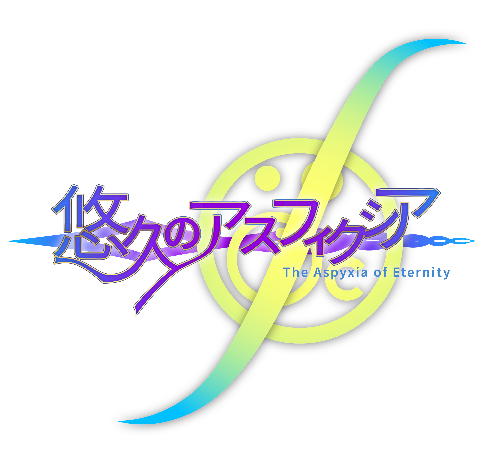

# 悠久のアスフィクシア -The Asphyxia of Eternity-

Plugin Version: **v2.0.0-beta** 

A plugin for RB supporting run on <a href="https://asphyxia-core.github.io">Asphyxia CORE</a>.

---

Features supported:

| **Feature** | **悠久のリフレシア** | **VOLZZA / VOLZZA 2** | **groovin'!! Upper** | **colette -All Seasons-** | **limelight** | **REFLEC BEAT**
| :-- | :-- | :-- | :-- | :-- | :-- | :-- |
| Profile saving | √ | √ | √ | √ | √ | √ |
| Score saving | √ | √ | √ | √ | √ | √ |
| Classcheck / Dojo | - | - | - | √ | √ | √ |
| Profile web UI | √ | √ | √ | √ | √ | √ |
| Puzzle comment | √ | √ | √ | √ | √ | √ |
| Ranking | × | × | × | × | × | × |
| Friends | × | × | × | × | × | × |

Events supported:

| **Version** | Events |
| :-- | :-- |
| **悠久のリフレシア** | <ul><li>REFLESIA MODE (Game & Web UI)</li><li>JUST COLLECTION (Game only)</li></ul> |
| **VOLZZA / VOLZZA 2** | <ul><li>パステルくんからゆるゆるコメント / Pastel-kun's casual comments (Game & Web UI)</li><li>どきどきリズム研究所 / Heartbeating Rhythm Lab. (Game only)</li><li>REFTIS (Game & Web UI)</li></ul>
| **groovin'!! Upper** | <ul><li>Pastel Wonder Quest (Game only)</li><li>Mystical Strike (Game only)</li></ul> |
| **colette -All Seasons-** | <ul><li>Order shop (Game & Web UI)</li><li>Pastel Adventure (Game only)</li><li>Pastel Wonder Traveller (Game only)</li><li>戦乱のVerdet / Verdet des Krieges (Game & Web UI)</li></ul> |
| **limelight** | <ul><li>Lime glasses (Game & Web UI)</li></ul> |

---

This project used some data for web UI and game from several external websites/project, listed as follows:

- [BEMANIWiki](http://bemaniwiki.com) for web UI data.
- [REFLEC BEAT @wiki](https://w.atwiki.jp/reflec_beat) for JUST REFLEC data and algorithm.
- [RemyWiki](http://remywiki.com) for some missing jackets.
- [Bemaniutils](https://github.com/DragonMinded/bemaniutils) for lobby structures/comment structures/RB colette event progress saving/RB groovin' episode data. 
- [Rb poor](https://github.com/cubele/rbsimulator) for .ply structures.

I'm appreciated for their help.

