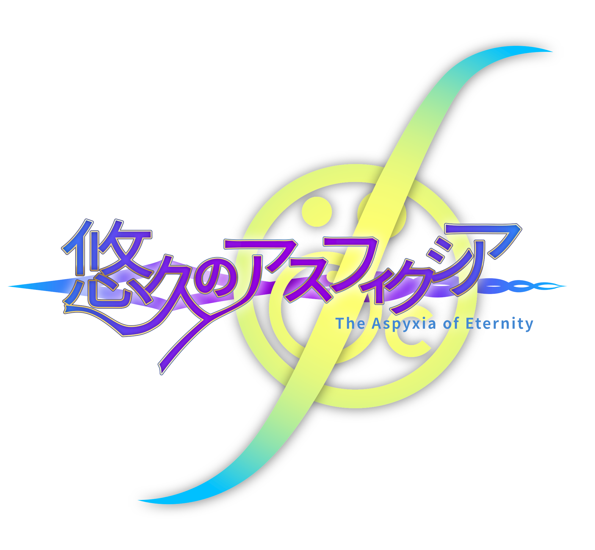

# 悠久のアスフィクシア -The Asphyxia of Eternity-

Plugin Version: **v2.0.1-beta** 

A plugin for RB supporting run on <a href="https://asphyxia-core.github.io">Asphyxia CORE</a>.

**After v2 update, the project needs to be build and not able to work properly by clone the project directory to plugins folder of Asphyxia CORE. Please download the plugin from the release page.**

## Features and events

Features supported:

| **Feature** | **悠久のリフレシア** | **VOLZZA / VOLZZA 2** | **groovin'!! & Upper** | **colette -All Seasons-** | **limelight** | **REFLEC BEAT**
| :-- | :-- | :-- | :-- | :-- | :-- | :-- |
| Profile saving | √ | √ | √ | √ | √ | √ |
| Score saving | √ | √ | √ | √ | √ | √ |
| Classcheck / Dojo | √ | √ | 〇* | - | - | - |
| Profile web UI | √ | √ | √ | √ | √ | √ |
| Puzzle comment | √ | √ | √ | √ | √ | - |
| Ranking | × | × | × | × | × | × |
| Friends | × | × | × | × | × | × |

_
*Classes above 師範 are not able to be unlocked for now.
_

Events supported:

| **Version** | Events |
| :-- | :-- |
| **悠久のリフレシア** | <ul><li>REFLESIA MODE (Game & Web UI)</li><li>JUST COLLECTION (Game only)</li></ul> |
| **VOLZZA / VOLZZA 2** | <ul><li>パステルくんからゆるゆるコメント / Pastel-kun's casual comments (Game & Web UI)</li><li>どきどきリズム研究所 / Heartbeating Rhythm Lab. (Game only)</li><li>REFTIS (Game & Web UI)</li></ul>
| **groovin'!! & Upper** | <ul><li>Pastel Wonder Quest (Game only)</li><li>Mystical Strike (Game only)</li></ul> |
| **colette -All Seasons-** | <ul><li>Order shop (Game & Web UI)</li><li>Pastel Adventure (Game only)</li><li>Pastel Wonder Traveller (Game only)</li><li>戦乱のVerdet / Verdet des Krieges (Game & Web UI)</li></ul> |
| **limelight** | <ul><li>Lime glasses (Game & Web UI)</li></ul> |

## To do list

- Implement web UI for these events:
  - Pastel Wonder Adventure
  - Pastel Wonder Traveller
  - Pastel Wonder Quest
  - Trophy system for RB groovin'
  - Mystical Strike
- Filter features for music records and play history page
- Musics wiki system
- Ranking feature and friend feature

## Credits

This project used some data for web UI and game from several external websites/project, listed as follows:

- [BEMANIWiki](http://bemaniwiki.com) for web UI data.
- [REFLEC BEAT @wiki](https://w.atwiki.jp/reflec_beat) for JUST REFLEC data and algorithm.
- [RemyWiki](http://remywiki.com) for some missing jackets.
- [Bemaniutils](https://github.com/DragonMinded/bemaniutils) for structures of some events. 
- [Rb poor](https://github.com/cubele/rbsimulator) for .ply data analyzing.
- Translated text of Verdet des Krieges and Pastel-kun's casual comments provided by Google Gemini.

I'm appreciated for their help.
