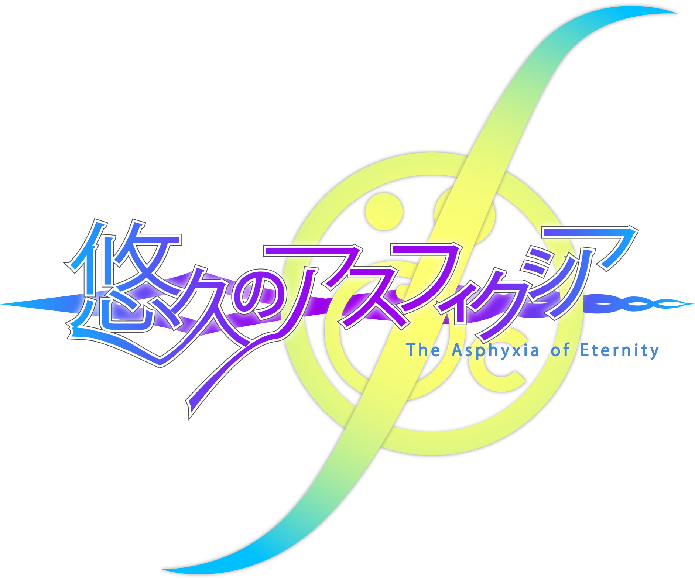

# 悠久のアスフィクシア -The Asphyxia of Eternity-

Plugin Version: **v1.0.3** 

A plugin for RB supporting run on <a href="https://asphyxia-core.github.io">Asphyxia CORE</a>.

---

Supported versions:

- **REFLEC BEAT 悠久のリフレシア**

    Supported features:
    
    - Account & settings & mylist saving
    - Score saving
    - Just collection saving
    - Character cards saving
    - Classcheck & quest progress saving
    - Web UI
    - Asphyxia savedata importing  

- **REFLEC BEAT VOLZZA 2**

    Supported features:

    - Account & settings & mylist saving
    - Score saving
    - Reftis
    - Classcheck
    - Web UI  

- **REFLEC BEAT groovin'!! Upper**

    Supported features:

    - Account & settings & mylist saving
    - Score saving
    - Reflec Dojo & Pastel Wonder Quest & Mystical Strike
    - Web UI  

- **REFLEC BEAT colette -All Seasons-**

    Supported features:

    - Account & settings & mylist saving
    - Score saving
    - Event progress saving
    - Web UI  

- **REFLEC BEAT limelight**

    Supported features:

    - Account & settings & mylist saving
    - Score saving
    - Web UI  

- **REFLEC BEAT**

    Supported features:

    - Account & settings saving
    - Score saving
    - Web UI

---

The project used some data for web UI and game from several external websites/project, websites/project are listed as follows:

- <a href="http://bemaniwiki.com/">BEMANIWiki</a> for web UI data.
- <a href="http://remywiki.com/">RemyWiki</a> for some missing jackets.
- <a href="https://github.com/DragonMinded/bemaniutils">Bemaniutils</a> for lobby structures/RB colette event progress saving/RB groovin' episode data. 

I'm appreciated for their help.
